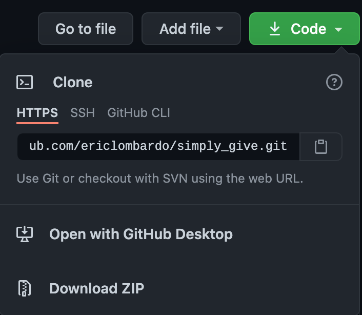
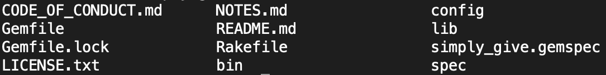
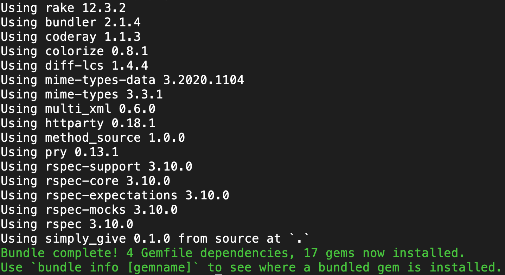
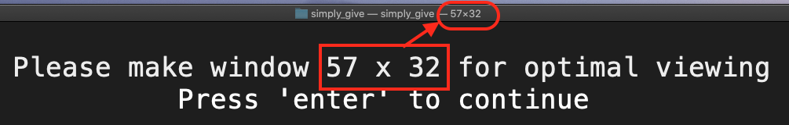

# SimplyGive

Simply Give was designed to help people who want to give to causes that they beleive in
but don't know what all their options are. This program solves that problem by giving the
user a easy to navigate interface that give them access to thousands of projects that charities
are currently working on. When you find a project or charity that you align with,
you are taken directly to the project site (on Global Giving website) or directly to the
charities website where you give to the cause.

## Installation

Clone the git repo onto your computer



Go into the root directory of the folder (files should include)



Once there execute:

    $ bundle install
   
    

Once the install is complete, run program by executeing:

    $ ./bin/simply_give

<!-- Add this line to your application's Gemfile:

```ruby
gem 'simply_give'
```

And then execute:

    $ bundle install

Or install it yourself as:

    $ gem install simply_give -->

## Usage

Upon launching the program you will be prompted to adjust the screen to the optimal size. 



After this, the program starts and you are able to choose a cause you want to find projects in. After you have entered a cause you are interested in, you are able to jump back to the main menu and select a different cause to look into.

## Build Status
While Simply Give is up and runnning there are many features that I would like to incorporate in the future. I would like to include a way to search by regions, track donations in an external file, and create person instances to expand the usability of the program.

## Development

After checking out the repo, run `bin/setup` to install dependencies. Then, run `rake spec` to run the tests. You can also run `bin/console` for an interactive prompt that will allow you to experiment.

To install this gem onto your local machine, run `bundle exec rake install`. To release a new version, update the version number in `version.rb`, and then run `bundle exec rake release`, which will create a git tag for the version, push git commits and tags, and push the `.gem` file to [rubygems.org](https://rubygems.org).

## Contributing

Bug reports and pull requests are welcome on GitHub at https://github.com/ericlombardo/simply_give. This project is intended to be a safe, welcoming space for collaboration, and contributors are expected to adhere to the [code of conduct](https://github.com/ericlombardo/simply_give/blob/master/CODE_OF_CONDUCT.md).


## License

The gem is available as open source under the terms of the [MIT License](https://opensource.org/licenses/MIT).

## Code of Conduct

Everyone interacting in the SimplyGive project's codebases, issue trackers, chat rooms and mailing lists is expected to follow the [code of conduct](https://github.com/ericlombardo/simply_give/blob/master/CODE_OF_CONDUCT.md).

## Attribution

The API used in this program was from Global Giving and can be found at: https://www.globalgiving.org/

